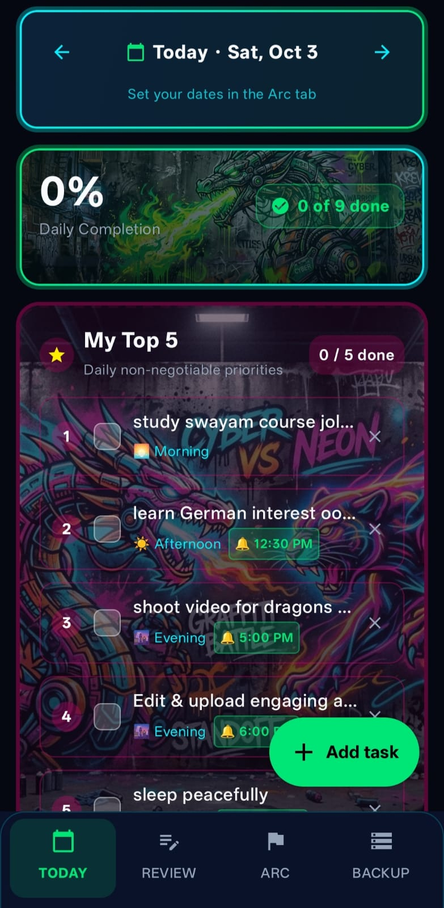
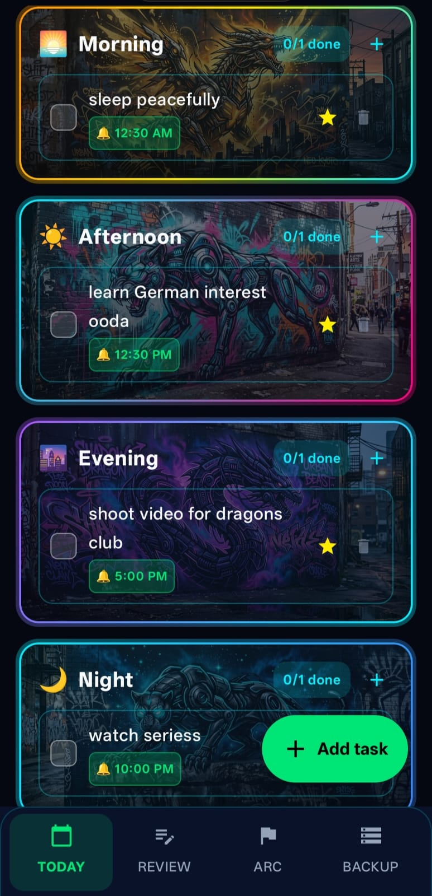
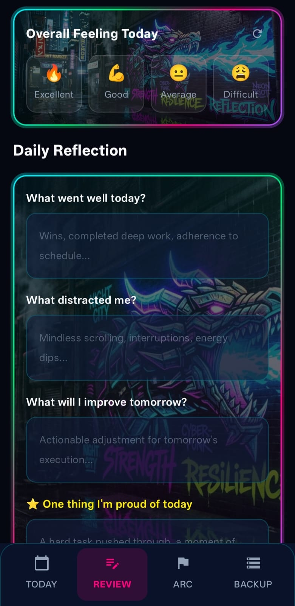
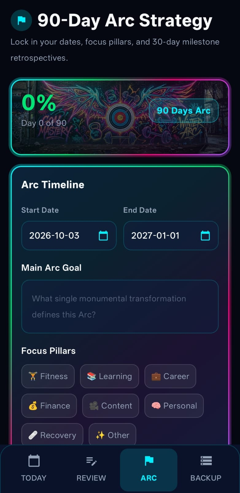
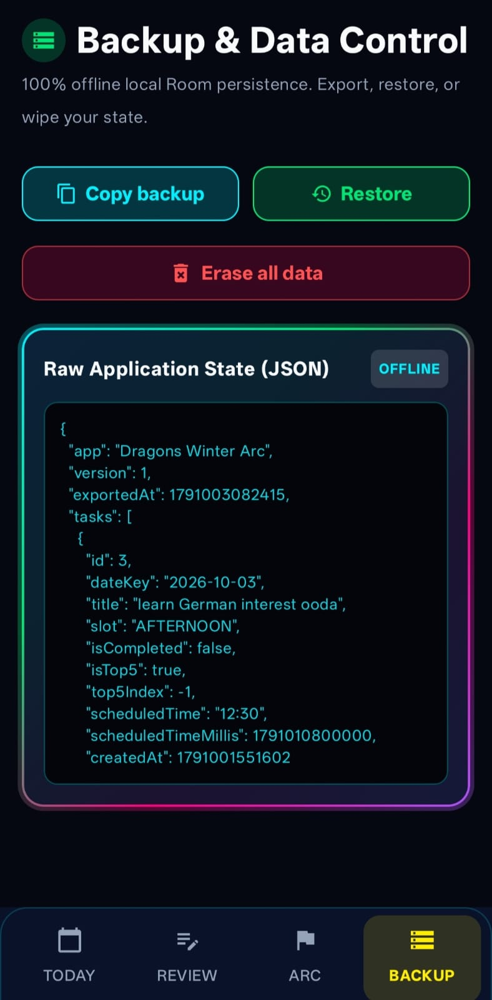

# 🐉 Winter Arc

<div align="center">

[-3DDC84?style=for-the-badge&logo=android&logoColor=white)](https://android.com)
[](https://kotlinlang.org)
[](https://developer.android.com/jetpack/compose)
[-F44336?style=for-the-badge&logo=sqlite&logoColor=white)](https://developer.android.com/training/data-storage/room)
[](.github/workflows/build-apk.yml)
[](LICENSE)

**Forged in discipline. Built for focus. Dominate your 90-day transformation.**

A dark cyber-themed daily routine tracker, Top 5 priority execution board, exact scheduled notification engine with Duolingo-style buoyant marimba chimes, and 90-day protocol manager.

[📥 Download](#-download--installation) • [📸 Screenshots](#-screenshots) • [⚡ Features](#-key-features) • [🏗️ Architecture](#-architecture--tech-stack) • [🛠️ Build Instructions](#%EF%B8%8F-building--local-development) • [🛡️ Privacy](#%EF%B8%8F-privacy--permissions)

</div>

---

## 📥 Download & Installation

Get the latest build of **Winter Arc** directly on your Android device:

* ⚡ **[Direct APK Download (Winter-Arc.apk)](https://github.com/ThanuHith/Winter-Arc-Dragons-Club/releases/latest/download/Winter-Arc.apk)** — *Best for standard mobile web browsers (Chrome, Brave, Edge).*
* 🏷️ **[View Latest Release & Changelog (v1.0.6)](https://github.com/ThanuHith/Winter-Arc-Dragons-Club/releases/tag/v1.0.6)** — *Recommended for social media & AutoDM links.*

> 💡 **Tip for In-App Browsers (WhatsApp / Instagram AutoDM):**  
> If clicking inside Instagram or WhatsApp causes the download to freeze, tap the **3 dots (⋮)** in the top right corner and select **"Open in Chrome"** to download and install instantly.

---

## 📸 Screenshots

| 1. Today Dashboard & Top 5 | 2. 4-Slot Daily Routine | 3. Daily Reflection Journal |
|:---:|:---:|:---:|
|  |  |  |
| *Top 5 priority board, streak counter & daily completion status* | *Morning, Afternoon, Evening, and Night structured routines* | *Overall feeling logger, daily wins, and reflection prompts* |

| 4. 90-Day Arc Strategy | 5. Offline Data & JSON Backup |
|:---:|:---:|
|  |  |
| *90-day trajectory timeline, goal setting & focus pillars* | *100% offline Room local persistence & raw JSON exporter* |

---

## ⚡ Key Features

### 1. 🌅 4-Slot Daily Routine Architecture
- Structured day partitioned into 4 distinct execution phases:
  - **Morning Routine** (05:00 - 12:00) — High alertness, physical conditioning, and morning rituals.
  - **Afternoon Sprint** (12:00 - 17:00) — Deep work, deliverables, and professional tasks.
  - **Evening Cool-down** (17:00 - 21:00) — Recovery, nutrition, and learning.
  - **Night Shutdown** (21:00+) — Reflection, device detox, and restful sleep.
- Real-time routine completion bar, visual beast art, and progress percentages.

### 2. 🎯 My Top 5 Priority Board
- Never drown in long, demotivating to-do lists.
- Dedicated high-leverage board displaying your top 5 non-negotiable daily objectives.
- Instant toggle and completion celebration.

### 3. 🔔 Exact Alarms & Duolingo-Style Marimba Chime
- **Exact Scheduling**: Powered by Android `AlarmManager.setExactAndAllowWhileIdle()` so reminders fire right on time—even in deep Android Doze mode.
- **Custom Audio Engine**: Bundles an acoustic, soft buoyant marimba bounce chime inspired by Duolingo (`res/raw/dragon_chime.mp3`) that is both pleasant and impossible to miss.
- **Interactive Audio Preview**: Clean circular audio button with zero text-wrapping glitches to audition or stop the chime directly inside the task creation dialog.
- **Reboot Persistence**: Automatically re-registers all pending alarms upon device reboot via `RECEIVE_BOOT_COMPLETED`.

### 4. ⚔️ 90-Day Winter Arc Strategy Protocol
- Track your 90-day personal transformation trajectory.
- Define core non-negotiable rules (sleep schedule, training regimens, diet, skill mastering).
- Visual countdown and completion percentage calculated automatically.

### 5. 📖 Nightly Review & Reflection Journal
- Structured journaling:
  - Daily Wins & Victories.
  - Key Lessons & Stumbling Blocks.
  - Energy and Mood ratings (1-5 scale).
- Historical archive to track your mindset evolution across the Arc.

### 6. 🛡️ 100% Offline-First & Zero Tracking
- **Complete Privacy**: No accounts, no login screens, no analytics SDKs, and zero telemetry.
- **Room SQLite Local Database**: All data stays permanently on your physical device.
- **JSON Backup & Restore**: One-tap export to backup your full database into a portable JSON file, and restore on any device anytime.

---

## 🏗️ Architecture & Tech Stack

- **Language**: Kotlin 2.0
- **UI Framework**: Jetpack Compose & Material 3 (Dark Cyberpunk Theme)
- **Architecture Pattern**: MVVM with Clean Architecture principles
- **Local Database**: Room SQLite Persistence Library
- **Background Operations**: Android `AlarmManager` with BroadcastReceiver reboot hooks
- **CI/CD Pipeline**: GitHub Actions (Automated Debug APK generation on release tag creation)

---

## 🛠️ Building & Local Development

### Prerequisites

- Android Studio Jellyfish or newer
- JDK 17 (Temurin)
- Android SDK 26+ (Target SDK 34)

### Building locally

1. **Clone the repository**:
   ```bash
   git clone [https://github.com/ThanuHith/Winter-Arc-Dragons-Club.git](https://github.com/ThanuHith/Winter-Arc-Dragons-Club.git)
   cd Winter-Arc-Dragons-Club
